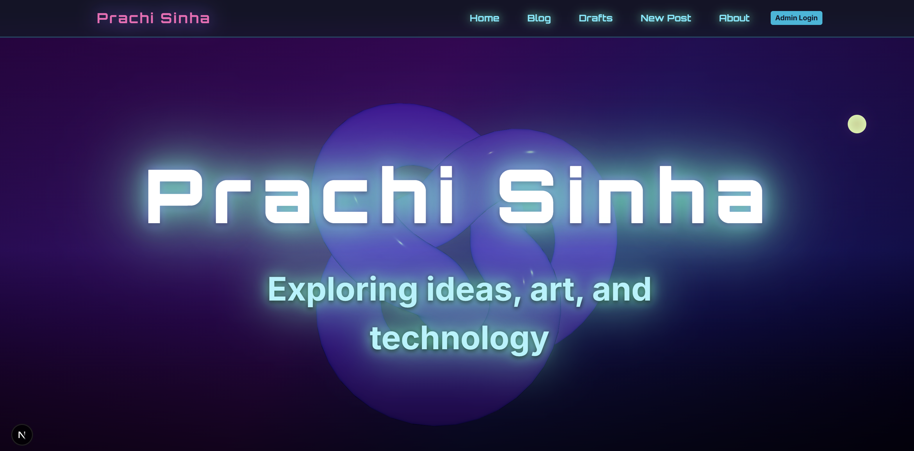
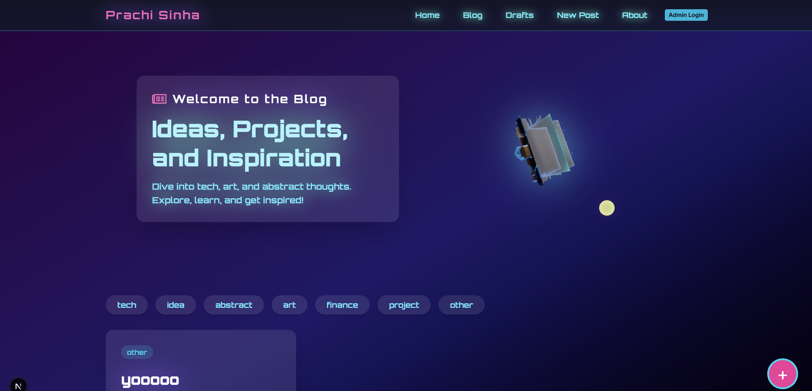
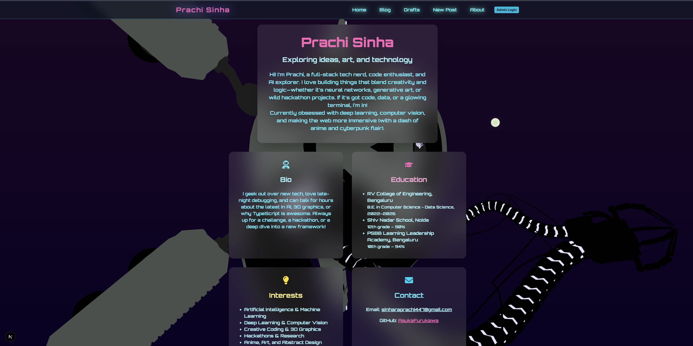

# Personal Blog – Cyberpunk 3D Edition

A visually striking, cyberpunk-inspired personal blog built with **Next.js**, **React Three Fiber**, **Tailwind CSS**, and **Framer Motion**. Share your ideas, projects, and inspirations with immersive 3D art and a bold, glassy UI.

---

## ✨ Features

- **Immersive 3D Hero & Accents:** GLB models as hero and accent elements (React Three Fiber)
- **Cyberpunk/Glassmorphism UI:** Bold fonts, glassy cards, heavy blur, and strong color contrasts
- **Animated Interactions:** Framer Motion for micro-interactions and page transitions
- **Blog Post Editor:**
  - Title, content, category, tags
  - Image upload/preview
  - Draft saving and publishing
- **Blog List & Filters:**
  - Editorial blog cards with hover effects
  - Category/tag filters
  - Masonry/staggered layout
- **Drafts Page:** Save and manage drafts
- **About Page:** Large 3D centerpiece, animated backgrounds, and glassy info cards
- **Local Persistence:** Posts and drafts saved in localStorage (for dev)
- **Responsive Design:** Looks great on desktop and mobile

---

## 🛠️ Tech Stack

- Next.js
- React Three Fiber & @react-three/drei
- Tailwind CSS
- Framer Motion
- TypeScript

---

## 🚀 Getting Started

```powershell
git clone https://github.com/AsukaFurukawa/MyBlog.git
cd MyBlog
npm install
npm run dev
```
Open your browser: [http://localhost:3000](http://localhost:3000)

---

## 📁 Project Structure

- `/src/app` – Next.js app directory (pages, layouts)
- `/src/components` – Reusable UI and 3D components
- `/public` – Static assets and 3D models (.glb), screenshots

---

## 🖼️ 3D Models

Place your `.glb` models in the `/public/` directory for use in the UI.  
Current models: `dron.glb`, `viking_book.glb`, `neon_pac-man.glb`, etc.

---

## 📝 Customization

- Edit 3D models, colors, and UI in `/src/components` and `/public`
- Update blog categories/tags in the code as needed

---

## 📦 Deployment

- Easily deploy to Vercel or Netlify
- Set up a custom domain for your blog

---

## 🖼️ Screenshots





---

## 🙏 Credits & Inspiration

- 3D models from Sketchfab and other open sources
- Inspired by [kodeimmersive.com](https://kodeimmersive.com), Noomo Labs, Local Studio, Aramco, and cyberpunk/glassmorphism design trends
- Special thanks to all reference sites and creators who inspired the design and features of this blog

---

## 🧑‍💻 Author

Prachi Sinha ([AsukaFurukawa](https://github.com/AsukaFurukawa))

---

Enjoy your futuristic blog! 🚀 